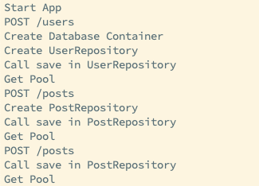
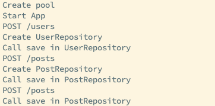

# PostgreSQL Pool Test

## Repository에서 pool을 사용할 때, 어떻게 사용해야 할까?

1. new Pool을 통해 생성된 pool을 가져와서 사용한다.
2. pool을 생성하는 컨테이너를 생성하고, 의존성 주입으로 Repository에서 가져와 getPool

new Pool을 통해 생성했을 때, Repository가 생성될 때마다 new Pool을 하게 되지 않을까?라는 생각을 하게 되었음. 그렇다면 Pool을 생성하는 컨테이너를 통해 getPool로 가져오는게 맞을까?라는 고민을 하게 됨.

## Container를 통해 pool을 생성하는 컨테이너 등록

### getPool을 위한 Container

```ts
import { Pool } from "pg";
import { Service } from "typedi";

@Service()
export default class Database {
  private readonly pool: Pool;

  private readonly opts = {
    user: process.env.DB_USER,
    password: process.env.DB_PASSWORD,
    host: process.env.DB_HOST,
    database: process.env.DB_DATABASE,
    port: Number(process.env.DB_PORT) || 5432,
  };

  constructor() {
    console.log("Create Database Container");
    this.pool = new Pool(this.opts);
  }

  getPool() {
    console.log("Get Pool");
    return this.pool;
  }
}
```

1. 예상되는 상황

   - Start App
   - Post 필요 시 Post Container 생성 \
      -> Database Container 최초 1회 생성(User, Post 상관 없이 Repository Container 생성 시)
   - 이후 다른 Repository Container는 각각 생성

2. 결과

   

   예상되는 상황과 동일하게 진행

### new Pool을 통한 생성

```ts
import { Pool } from "pg";
import dotenv from "dotenv";

dotenv.config();

const opts = {
  user: process.env.DB_USER,
  password: process.env.DB_PASSWORD,
  host: process.env.DB_HOST,
  database: process.env.DB_DATABASE,
  port: Number(process.env.DB_PORT) || 5432,
};

const pool = new Pool(opts);
console.log("Create pool");

export default pool;
```

1. 예상한 상황

   - Start App
   - Repository Container 생성 시 new Pool 진행

2. 결과

   

   new Pool은 앱이 실행되면서 전역 객체로 생성됨. \
   각 Repository Container가 생성될 때, 이미 생성된 전역 객체인 pool을 가져오기만 함. (계속 생성하지 않음)

### 예상치 못한 상황

1. `dotenv.config()`를 통해 `.env` 내용을 가져올 때, \
   DB Container 를 사용하는 상황은 app.ts에서 선언해도 괜찮았는데, \
   new Pool을 사용할 땐, pool 내에서 사용해야 했음.

2. import pool from './pool'은 가져올 때마다 new Pool이 진행되는 것이 아니라 앱 실행 시 new Pool은 진행되고 생성된 pool을 가져오는 것이었음
